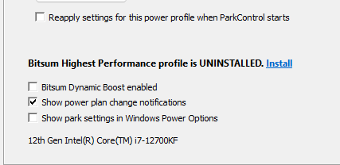
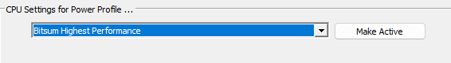

## Stress testing

best test i came up with was running furmark and watching temps, looking for artifacts. if it can handle furmark for extended periods of time then it's most likely not a hardware failure

furmark: https://geeks3d.com/dl/show/831
hwinfo for looking at  temps: https://www.hwinfo.com

## CPU parking & power settings

for weird frame pacing, i've found that to be CPU bound. turning off park control for the CPU and changing the power plan made a HUGE difference for me (i'd recommend this for anyone running a PC if it's not a laptop tbh)
download park control: https://bitsum.com/parkcontrol/

- install the bitsum profile
<td></td>

- select 'bitsum highest performance' and make active
<td></td>

- park control wants to start on windows startup by default, but after the power plan is set it's not necessary. so you probably want to turn that off

## Clean GPU driver install

1. Download DDU, an NVIDIA driver, and NvidiaProfileInspector. If you're on an older driver version, use the latest version. if you're on the latest version, try an older version (e.g. 581.80 game ready)
    - DDU: https://www.wagnardsoft.com/DDU/download/DDU%20v18.1.4.0_setup.exe
    - Drivers: https://www.nvidia.com/en-us/geforce/drivers/
    - NvidiaProfileInspector: https://github.com/Orbmu2k/nvidiaProfileInspector/releases/download/2.4.0.31/nvidiaProfileInspector.zip

2. Unzip and run NvidiaProfileInspector
    - Export (Up arrow in the toolbar) -> Export all customized profiles
    - Select All
    - Export somewhere memorable

3. Install DDU

4. Unplug ethernet cable or disconnect from internet (stops windows from auto-installing generic GPU drivers)

5. Boot into safe mode
    - Hold shift then restart the computer. Keep holding shift until the options pop up
    - Troubleshoot -> Advanced options -> Startup settings -> Restart
    - Select safe mode (no networking)

6. Run DDU 
    - Select device type (GPU)
    - Select device (NVIDIA)
    - Clean and restart

7. Boot normally and install the downloaded NVIDIA driver
    - Select "custom" and "perform clean installation" in the installer

8. Run NvidiaProfileInspector again
    - Import Profile(s) (down arrow in toolbar)
    - Select the profile exported earlier

9. Done. You can plug in your ethernet cable again